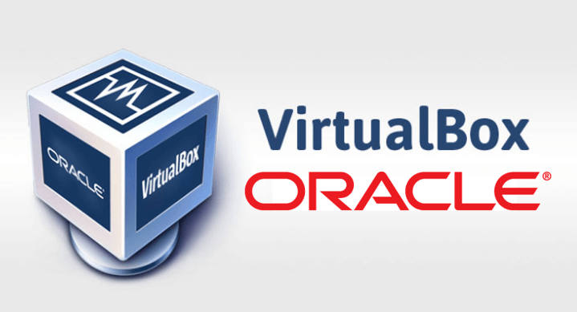

# Preparação de Ambiente
### Vamos preparar o ambiente para desenvolvimento de aplicações

#### Neste ambiente iremos instalar e configurar os seguintes recursos:
 - Máquina Virtual(Virtualbox)
 - Distribuição Linux(Ubuntu Server)
 - Nasm
 - Compilador da linguagem C
 - Configurar o ip e a porta de comunicação entre a máquina real e a virtual
 - Configurar o acesso via SSH entre o VSCode e o ServidorLinux
 - Instalar as extensões: Material Icon, Nasm, SSH e Linguagem C/C++

#### Máquina Virtual(Virtualbox)

Máquina virtual é uma ferramenta que permite a crição de novos "computadores" e a instalação de sistemas operacionais, para estudo ou trabalho.

Para o nosso estudo iremos usar o VirtualBox, da Oracle.
Para instalar, basta fazer o download no link a seguir:

<a href="https://www.virtualbox.org/wiki/Downloads" target="_blank"> VirtualBox </a>

##### Criando a máquina virtual para o nosso estudo

 - Configuração:
    > - Nome da Máquina: Servidor
    > - Memória: 4GB(4096)
    > - Processador: 2
    > - Disco: 100GB
    > - IP e Porta do Host: 127.0.0.1 e 22
    > - IP e Porta do Convidado: 10.0.2.15 e 22

- Tela inicial de configuração

- Tela configuração do Hardware

- Tela de configuração do Disco

- Tela Final de configuração

- Tela inicial de configuração de Rede

- Tela de configuração de Portas e IP

#### Distribuição Ubuntu Server

Para o nosso estudo iremos utilizar uma distribuição Linux para servidores chamada Ubuntu.
Acompanhe o processo de instalação:

Faça o download aqui: 
<a href="https://ubuntu.com/download/server" target="_blank"> Ubuntu Server </a>

- Acompanhe a instalação

- Tela de Inicio de instalação

- Tela de seleção de idioma

- Tela de seleção de teclado - portugues brasil

- Tela de tipo de instalação

- Tela configuração de rede

- Tela configuração do proxy

- Tela pacontes de atualização

- Tela configuração do disco

- Tela layout do disco

- Tela configuração do usuario

- Tela configuração do SSH

- Tela do fim da instalação

